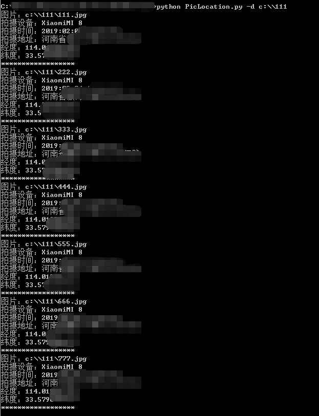

# PicLocation 0.1

这个脚本可以快速获取指定图片的拍摄GPS、拍摄设备、时间和地点等信息。其原为我某个程序的一个模块，由于此脚本会在某些社工追溯的场景下使用，所以独立提了出来。

## Author ##

咚咚呛 

如有其他建议，可联系微信280495355

## Support ##

满足如下需求

	1、获取指定图片的拍摄信息，如拍摄设备、拍摄地址、拍摄时间、GPS等
	2、可指定图片目录，遍历获取大量图片的信息

## Dependencies ##
> pip install -r requirements.txt

## Config ##

脚本使用配置如下

	1、程序存在两个参数-d和-p，可以指定图片目录或者图片文件
	2、比如执行命令：
	python PicLocation.py -d c:\\111
	python PicLocation.py -p 123.jpg

## Screenshot ##

